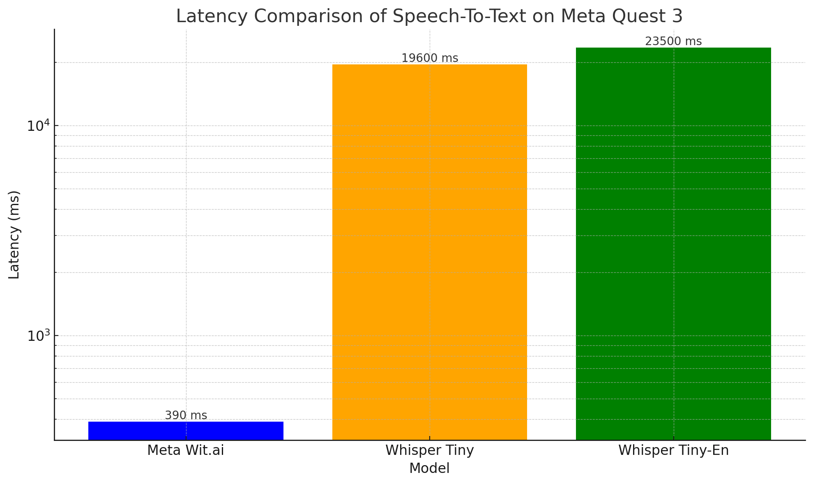

# whisper.unity on Meta Quest 3
 

This project integrates Unity3D bindings for [whisper.cpp](https://github.com/ggerganov/whisper.cpp) to run OpenAI's Whisper ASR model locally on Meta Quest 3. Based on the original [whisper.unity](https://github.com/macoron/whisper.unity) repository by @Macoron.

## Features
- High-performance inference of Whisper ASR model
- Supports around 60 languages
- Can translate between languages
- Runs entirely on Meta Quest 3 without Internet connection
- Free and open source

## Project Details
This project uses the Whisper model to transcribe a sample scene with JFK's audio file containing his famous line: "Ask not what your country can do for you – ask what you can do for your country." The transcription tests were conducted to measure latency on the Meta Quest 3 headset.

### Latency Comparison

## Getting Started
Clone this repository and open it as a regular Unity project. It comes with examples and a tiny multilingual model.

Alternatively, add this repository to your project as a **Unity Package** using the following git URL:

https://github.com/Macoron/whisper.unity.git?path=/Packages/com.whisper.unity

### Downloading Other Model Weights
You can try different Whisper model weights to improve transcription quality. Download model weights from [here](https://huggingface.co/ggerganov/whisper.cpp) and place them in your `StreamingAssets` folder.

## License
This project is licensed under the MIT License. It uses compiled libraries and model weights from [whisper.cpp](https://github.com/ggerganov/whisper.cpp), also licensed under MIT.